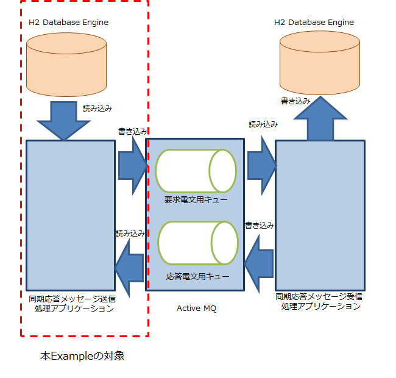

nablarch-example-mom-sync-send-batch
====================================

| master | develop |
|:-----------|:------------|
|||

Nablarch FrameworkのMOM同期応答メッセージングの送信側のExampleです。
MOM同期応答メッセージングの受信側のExampleと組み合わせて使用します。

以下にメッセージングのシステムのうち、本Exampleが対象とする箇所を示します。

## 実行手順

### 1.動作環境
実行環境に以下のソフトウェアがインストールされている事を前提とします。
* Java Version : 8
* Maven 3.0.5以降

補足：
MOMは、MOM同期応答メッセージングの受信側のExampleに組み込まれたものを使用します。
RDBMSは、本Exampleに組み込まれたものを使用します。

### 2. プロジェクトリポジトリの取得
Gitを使用している場合、アプリケーションを配置したいディレクトリにて「git clone」コマンドを実行してください。
以下、コマンドの例です。

    $mkdir c:\example
    $cd c:\example
    $git clone https://github.com/nablarch/nablarch-example-mom-sync-send-batch.git

Gitを使用しない場合、最新のタグからzipをダウンロードし、任意のディレクトリへ展開してください。

### 3. アプリケーションのビルド
#### 3.1. データベースのセットアップ及びエンティティクラスの作成
まず、データベースのセットアップ及びエンティティクラスの作成を行います。以下のコマンドを実行してください。

    $cd nablarch-example-mom-sync-send-batch
    $mvn clean generate-resources

#### 3.2. アプリケーションのビルド
次に、アプリケーションをビルドします。以下のコマンドを実行してください。

    $mvn package

### 4. アプリケーションの起動

先にMOM同期応答メッセージングの受信側のExampleを起動しておいてください。

以下のコマンドで、データベースの状態を最新化、MOM同期応答メッセージングの送信側のExampleが起動します。

    $mvn generate-resources
    $mvn exec:java -Dexec.mainClass=nablarch.fw.launcher.Main -Dexec.args="'-diConfig' 'messaging-sync-send-boot.xml' '-requestPath' 'SendProjectInsertMessageAction' '-userId' 'batch_user'"

なお、 `maven-assembly-plugin` を使用して実行可能jarの生成を行っているため、以下のコマンドでもアプリケーションを実行することが可能です。
    $java -jar target/application-<version_no>.jar -diConfig classpath:messaging-sync-send-boot.xml -requestPath SendProjectInsertMessageAction -userId batch_user

起動に成功すると、MOM同期応答メッセージングの受信側との通信を行い、以下のようなログがコンソールに出力されます。
ログ出力後、本Exampleは自動的に終了します。

    2016-06-07 17:18:33.232 -INFO- ROO [null] @@@@ APPLICATION SETTINGS @@@@
            system settings = {
            }
            business date = [20140123]
    2016-06-07 17:18:33.248 -INFO- ROO [201606071718332480002] execute PROJECT_INS_REQ_ID [1]
    2016-06-07 17:18:34.077 -INFO- ROO [201606071718332480002] @@@@ SENT MESSAGE @@@@
            thread_name    = [pool-1-thread-1]
            message_id     = [ID:S1306C00419-T1-58114-1465287513655-1:1:1:1:1]
            destination    = [TEST.REQUEST]
            correlation_id = [null]
            reply_to       = [TEST.RESPONSE]
            time_to_live   = [0]
            message_body   = [ProjectInsertMessage0
    プロジェクト００１
                                                                                                                                               development

                                                       s
                                                                                                                                                                                                           20100918201504091        鈴木

                                                                                                                                          佐藤

                                                100      備考欄

                                                                                                                                                                              10000    1000     2000     3000
    ]
    2016-06-07 17:18:35.545 -INFO- ROO [201606071718332480002] @@@@ RECEIVED MESSAGE @@@@
            thread_name    = [pool-1-thread-1]
            message_id     = [ID:S1306C00419-T1-42773-1465286271571-4:1:1:1:1]
            destination    = [TEST.RESPONSE]
            correlation_id = [ID:S1306C00419-T1-58114-1465287513655-1:1:1:1:1]
            reply_to       = [null]
            message_body   = [ProjectInsertMessage0success

    ]
    2016-06-07 17:18:35.685 -INFO- ROO [201606071718332320001]
    Thread Status: normal end.
    Thread Result:[200 Success] The request has succeeded.
    2016-06-07 17:18:35.685 -INFO- ROO [201606071718332320001] TOTAL COMMIT COUNT = [1]
    2016-06-07 17:18:35.685 -INFO- ROO [201606071718332320001] @@@@ END @@@@ exit code = [0] execute time(ms) = [3395]

### 5. DBの確認方法

1. http://www.h2database.com/html/cheatSheet.html からH2をインストールしてください。

2. {インストールフォルダ}/bin/h2.bat を実行してください(コマンドプロンプトが開く)。  
  ※h2.bat実行中はExampleアプリケーションからDBへアクセスすることができないため、Exampleアプリケーションを停止しておいてください。

3. ブラウザから http://localhost:8082 を開き、以下の情報でH2コンソールにログインしてください。
   JDBC URLの{dbファイルのパス}には、`SAMPLE.h2.db`ファイルの格納ディレクトリまでのパスを指定してください。  
  JDBC URL：jdbc:h2:{dbファイルのパス}/SAMPLE  
  ユーザ名：SAMPLE  
  パスワード：SAMPLE
